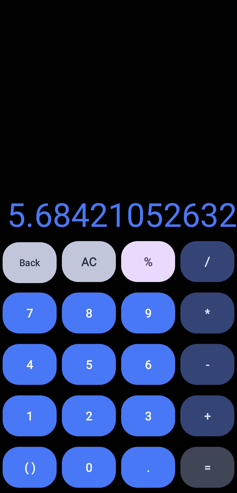
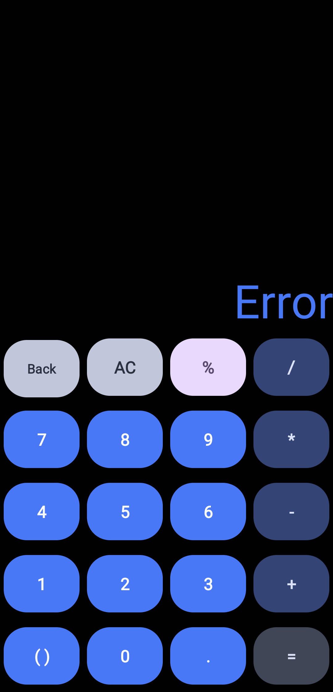

# **Stack-Based Android Calculator**
A simple calculator application that solves infix mathematical 
expressions, transforming them to postfix (Reverse Polish notation) 
expressions and then evaluates them respecting the order of operations.

# **Valid Operations**
- **Basic operations:**
  - Addition
  - Subtraction
  - Multiplication
  - Division
```
The infix expression 5*9/1+2-1
is calculated as 59*1/21-
Result: 59*1/2+1- = 46
```
- **Use of parenthesis to maintain order of operations.**
```
The infix expression (2+3)*4 has a different result from 2+3*4
(2+3)*4 is calculated as 23+4*, while 2+3*4 as 234*+
Result: 23+4* = 20 and 234*+ = 14
```
- **Calculate the percent of a number**
```
The infix expression 50 + 5% 
is calculated as 50 2.5 + (2.5 is 5% of 50)
Result: 52.5
```


# UI
Simple User Interface that has a keyboard in a 4*5 grid containing:
- Buttons for each number 0-9
- Button for each operator (+, -, *, /)
- Per cent Button (%)
- AC Button
- BackSpace Button
- Open or close Parenthesis
- Equals Button (In order to calculate the expression)

## Requirements
**Android Version 7.0 (SDK v24) and above is required to run the application**

## Release 1.0.0 now available under releases in repository!

## UI Description and Screenshots

The expression is shown to the user using a text view above the keyboard on the right
hand side of the screen. The user using the keyboard can type the expression they want to calculate


<br>
<br>
When the user presses the equals button the expression is calculated and the 
text view changes to the result.
Then the user can use the result as a new expression.



<br>
<br>
In case of malformed expression or division by 0 the result shown to the user is "Error".



<br>
The colours of the application's elements (buttons, text) change dynamically using the colour theme
the user has on their phone. Also supports both light and dark mode.

<p float="left">


</p>

# **Calculation Process**
The application uses helper functions to pipeline the calculation process. <br>

## Core Functions
### **-tokenize(String)**
This function takes as input the expression, that the user has typed, as a String and converts it
to an ArrayList containing Strings so it can be used in latter steps of the calculation
pipeline.

### **-infixToPostfix(ArrayList<String>)**
This function takes as input an expression as an ArrayList (that the previous function created)
and transforms the expression from infix notation form to postfix notation (reverse Polish), 
using a simple stack based algorithm. 

### **-calculatePostfix(ArrayList<String>)**
This function takes as input an expression as an ArrayList (in the postfix notation)
and using a stack-based algorithm the expression is calculated and the result is returned
as a Double.

##### The pipeline returns null if the expression is malformed or division by 0 occurs

## Helper Functions

### **-isOfLowerOrEqualOrder(String current, String onStack)**
This function is used in infixToPostfix function in order to determine whether the
current operator is of lower or equal order than the operator inside the stack.
Return True or False.

### **-isOperator(String) / isOperator(char)**
Function that returns True or False depending on whether the character is an operator
(+, -, *, /).

### **isNumeric(String)**
Function that returns True or False depending on whether the character is a number

### **-printResult(Double)**
Converts the result to a correct form converted to BigDecimal
(If number is natural it will be displayed without the decimal point)

##### All functions have been tested using standard JUNIT test files


